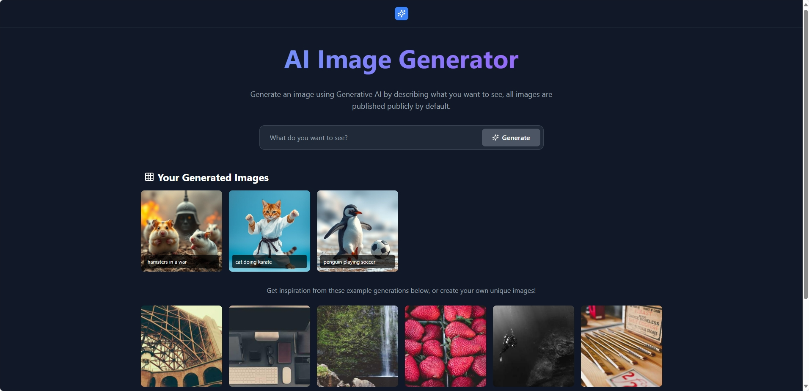

# 🎨 AI Image Generator

A modern, responsive web application that generates stunning images using AI technology. Simply describe what you want to see, and watch as artificial intelligence brings your ideas to life!


## ✨ Features

- **🤖 AI-Powered Generation**: Create unique images from text descriptions using the Pollinations AI API
- **💾 Local Storage**: Your generated images persist across browser sessions
- **📱 Fully Responsive**: Optimized for mobile, tablet, and desktop devices
- **🎯 Lazy Loading**: Efficient image loading for better performance
- **⚡ Fast & Lightweight**: Built with React and optimized for speed
- **🔄 Auto Retry**: Automatic retry mechanism for failed image loads
- **🎨 Beautiful UI**: Modern gradient design with smooth animations
- **📥 Download Support**: Save your favorite generated images
- **🖼️ Example Gallery**: Get inspired by example images

## 🚀 Demo

[Live Demo](https://ai-image-generator-five-rouge.vercel.app/)

## 📸 Screenshots



## 🛠️ Built With

- **React** - UI Framework
- **Tailwind CSS** - Styling
- **Lucide React** - Beautiful icons
- **Pollinations AI** - Image generation API
- **Picsum Photos** - Example stock images

## 📋 Prerequisites

Before you begin, ensure you have the following installed:
- Node.js (v14 or higher)
- npm or yarn

## 🔧 Installation

1. **Clone the repository**
   ```bash
   git clone https://github.com/Tian-Jacobs/ai-image-generator.git
   cd ai-image-generator
   ```

2. **Install dependencies**
   ```bash
   npm install
   ```

3. **Start the development server**
   ```bash
   npm start
   ```

4. **Open your browser**
   Navigate to [http://localhost:3000](http://localhost:3000)

## 📦 Build for Production

Create an optimized production build:

```bash
npm run build
```

The build files will be in the `build` folder, ready for deployment.

## 🎯 Usage

1. **Enter a Description**: Type what you want to see in the input field (e.g., "cat doing karate", "sunset over mountains")
2. **Generate**: Click the "Generate" button or press Enter
3. **Wait**: The AI will process your request (takes a few seconds)
4. **View & Download**: Your image will appear in the gallery. Hover over it to download
5. **Persist**: All generated images are saved locally and will remain after page refresh

## 🌟 Key Components

### Image Generation
- Uses Pollinations AI API for image generation
- Generates unique images with random seeds
- Prevents caching issues with timestamp-based URLs

### Local Storage
- Automatically saves all generated images
- Persists across browser sessions
- Implements error handling for storage quota

### Responsive Design
- Mobile-first approach
- Adaptive grid layouts
- Touch-friendly interface

## 🔨 Available Scripts

### `npm start`
Runs the app in development mode at [http://localhost:3000](http://localhost:3000)

### `npm test`
Launches the test runner in interactive watch mode

### `npm run build`
Builds the app for production to the `build` folder

### `npm run eject`
**Note: this is a one-way operation!** Ejects from Create React App for full configuration control

## 📱 Mobile Optimization

- Optimized image sizes for mobile networks
- Lazy loading for better performance
- Reduced motion support for accessibility
- Touch-friendly hover states
- Responsive typography and spacing

## 🤝 Contributing

Contributions are welcome! Please feel free to submit a Pull Request.

1. Fork the project
2. Create your feature branch (`git checkout -b feature/AmazingFeature`)
3. Commit your changes (`git commit -m 'Add some AmazingFeature'`)
4. Push to the branch (`git push origin feature/AmazingFeature`)
5. Open a Pull Request

## 📝 License

This project is licensed under the MIT License - see the [LICENSE](LICENSE) file for details.

## 🙏 Acknowledgments

- [Pollinations AI](https://pollinations.ai/) for the image generation API
- [Picsum Photos](https://picsum.photos/) for example images
- [Lucide](https://lucide.dev/) for the beautiful icons
- [Tailwind CSS](https://tailwindcss.com/) for the styling framework

## 📧 Contact

Tian Jacobs - [@BlessedT99](https://github.com/Tian-Jacobs)

Project Link: [https://github.com/Tian-Jacobs/ai-image-generator](https://github.com/Tian-Jacobs/ai-image-generator)

## 🐛 Known Issues

- None currently reported

## 🔮 Future Enhancements

- [ ] Add multiple AI model options
- [ ] Implement image editing features
- [ ] Add sharing functionality
- [ ] Create user accounts for cloud storage
- [ ] Add image style presets
- [ ] Implement batch generation
- [ ] Add image history search

---

Made with ❤️ by [Tian Jacobs](https://github.com/Tian-Jacobs)